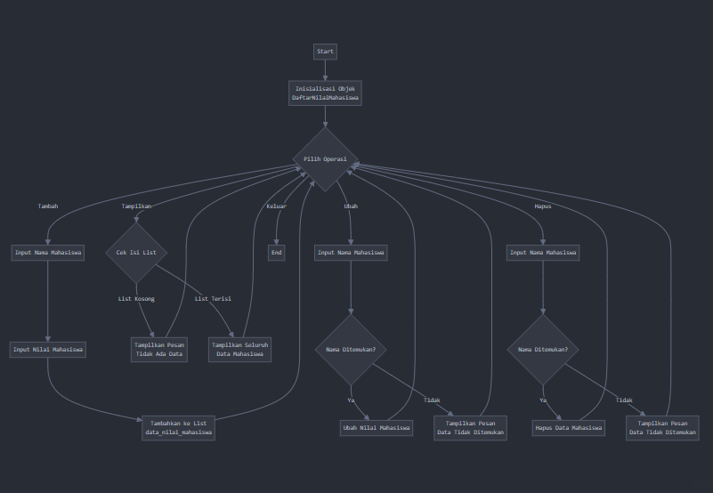
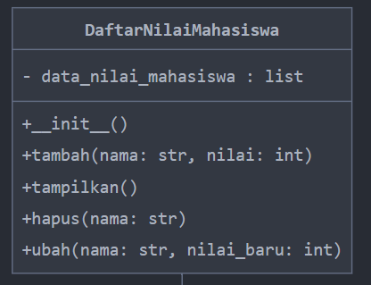
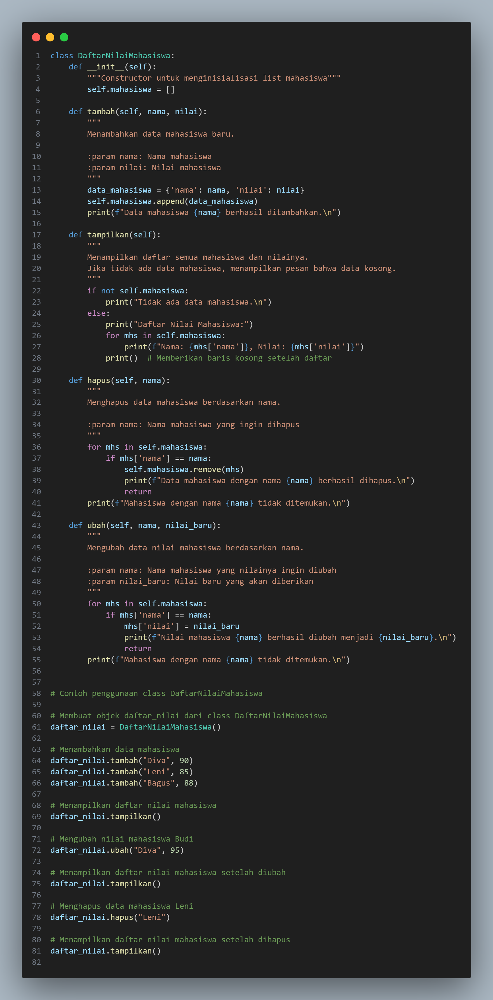
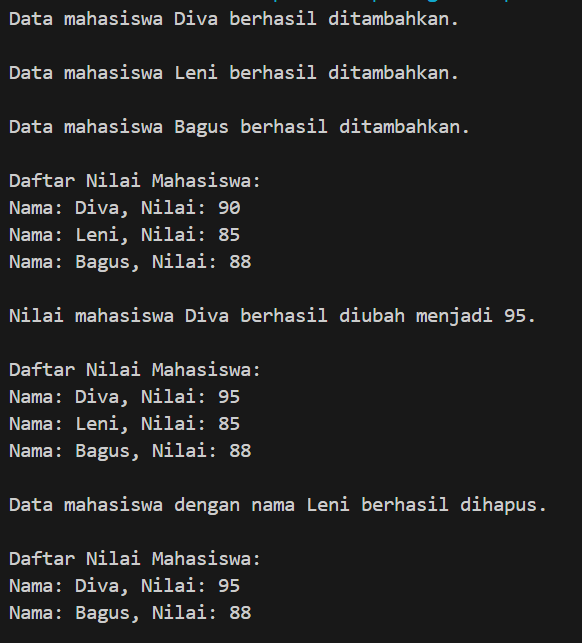

# TUGAS PARKTIKUM 8
# Data diri 

Nama: Diva Zahrotunnisa

NIM: 312410415

Kelas: TI.24.A3

## Deskripsi Program
Program ini dibuat untuk mengelola daftar nilai mahasiswa dengan menggunakan konsep Object-Oriented Programming (OOP) di Python. Program ini memiliki beberapa fitur utama sebagai berikut:
1. **Tambah Data**: Menambahkan data mahasiswa baru ke dalam daftar.
2. **Tampilkan Data**: Menampilkan daftar mahasiswa beserta nilai mereka.
3. **Ubah Data**: Mengubah nilai mahasiswa berdasarkan nama.
4. **Hapus Data**: Menghapus data mahasiswa berdasarkan nama.

## Flowchart



# Digram class



# input & output

## input tambah data



## output tambah data



## Penjelasan Kode
Program ini menggunakan kelas `DaftarNilaiMahasiswa` untuk mengelola data mahasiswa. Berikut adalah penjelasan setiap bagian dari kode:

### 1. **Class `DaftarNilaiMahasiswa`**
Class ini berfungsi untuk mengelola data mahasiswa, yang disimpan dalam bentuk list of dictionaries. Setiap dictionary berisi nama mahasiswa dan nilai mereka.

#### Method:
- **`__init__(self)`**: Menginisialisasi list kosong `mahasiswa` untuk menyimpan data mahasiswa.
- **`tambah(self, nama, nilai)`**: Menambahkan data mahasiswa baru ke dalam list.
- **`tampilkan(self)`**: Menampilkan semua data mahasiswa yang ada.
- **`hapus(self, nama)`**: Menghapus data mahasiswa berdasarkan nama.
- **`ubah(self, nama, nilai_baru)`**: Mengubah nilai mahasiswa berdasarkan nama.

### 2. **Contoh Penggunaan**
Program ini diimplementasikan dengan membuat objek dari class `DaftarNilaiMahasiswa`, kemudian menggunakan metode untuk menambahkan, menampilkan, mengubah, dan menghapus data mahasiswa.

#### Langkah-langkah Penggunaan:
1. Menambahkan mahasiswa baru dengan menggunakan `tambah()`.
2. Menampilkan seluruh data mahasiswa dengan menggunakan `tampilkan()`.
3. Mengubah nilai mahasiswa tertentu dengan menggunakan `ubah()`.
4. Menghapus data mahasiswa berdasarkan nama dengan menggunakan `hapus()`.

## Cara Menjalankan Program
1. Pastikan Anda telah menginstal Python di komputer Anda.
2. Salin kode program ke dalam file Python (`daftar_nilai.py`).
3. Jalankan program menggunakan perintah:
    ```bash
    python daftar_nilai.py
    ```

Program ini akan meminta input dari pengguna melalui terminal dan akan menampilkan output sesuai dengan tindakan yang dilakukan.

## Fitur dan Kemampuan:
- Menambah mahasiswa baru ke dalam daftar.
- Menampilkan daftar mahasiswa dengan nama dan nilai.
- Mengubah nilai mahasiswa berdasarkan nama.
- Menghapus data mahasiswa berdasarkan nama.
